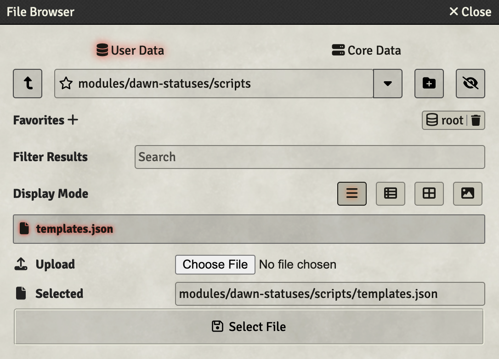

# What does this do?

This is a foundry module to help you play the [DAWN](https://joel-happyhil.itch.io/dawn) TTRPG system.

# Features

* Character sheets for PCs and NPCs using [Custom System Builder](https://foundryvtt.com/packages/custom-system-builder).
* Automatic Compound Enemy statistic calculations.
* Dice Rolling macros.
* Damage application macros.
* Automatic Tension Management using [Party Resources](https://foundryvtt.com/packages/fvtt-party-resources).
* Status effects that do something: Reinforced, Shredded

# Installation

### Step 1 - Install necessary modules

Install this module, and the two linked modules. Create a world using all Installed Modules

### Step 2 - Create Tension Resource

### Step 3 - Import Templates

Templates are shipped as a file in the module, so there's nothing more to download, but you do have to install them manually.

Open the import dialog from the Game Settings tab as the GM and navigate as shown:

### Step 4 - As a player, create your sheet and techniques

As a player, create a Character actor and use the "PC Template" template.
For each technique that you have, create an "Equippable Item" using the "[Technique]" template:

![Techniques are all equippable items using the \[Technique\] template](images/Technique%20Example.png)

After creating the techniques, drag them from the item tray to your character sheet.

NOTE: The "maximum focus" field on the structured combat tab is only for if you want to put a focus bar on your token. The game implements no actual maximum focus.

### Step 5 - As a GM, create NPCs, NPC Types, Edges, and Techniques

NPCs are actors that use the "NPC Template" template. Unlike with PCs, almost nothing on this sheet is fillable. Set the character image and adjust anything you need to on the prototype token, like the width and height for giants.

The rest of the NPC are items:

NPC Type items are for your basic NPC traits. NPCs require at least one type, and having multiple types creates a compound.

NPC Edge items are for any Edges you want to give the NPC. Use these for data entry deduplication only. It also looks pretty good to put the edge in the Notes & Intent text field on the NPC sheet.

NPC Techniques are for what are called "Technique Modifiers" these are ways to make an NPC more challenging without giving it more health or an additional health gate.

As with PCs, drag any items from the item tray into the NPC sheet.

Remember, AFTER dragging an item to an NPC, you can *edit* that item by clicking on any of the square links with the item's name. You can see all attached items on the debug tab. Edit items to tier them up or down, or to re-flavor attacks and actions.

## Step 6 - Module Recommendations

These modules work particularly well with the DAWN system

* [Monk's Little Details](https://foundryvtt.com/packages/monks-little-details) - Adds names to the status window
* [Lancer Initiative](https://foundryvtt.com/packages/lancer-initiative) - Implements Popcorn Initiative
* [Global Progress Clocks](https://foundryvtt.com/packages/global-progress-clocks) - Clocks for the GM (Clocks for PCs are on their sheet)